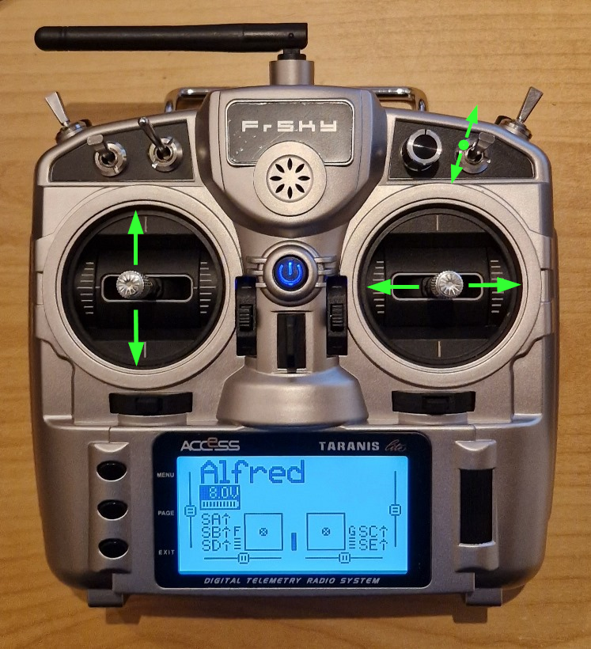

# Sunray_SBUS_AddOn
Sunray remote control via SBUS (e.g. FrSky)

With this add-on for Alexander Grau's Ardumower Sunray Software (https://github.com/Ardumower/Sunray) you can add manual remote control to your Alfred (and Ardumower?).

An SBUS receiver (e.g. FrSKy) is used to receive the remote control data and an ESP32 Dev Board is used for post-processing and converting the data to an I²C interface.

There are three operation modes which can be choosen from the RC transmitter:
1. Automatic mode as usual
2. Manual movement control without mow motor
3. Manual movement control with running mow motor
   
If a failsafe occurs or if the RC transmitter is switched off, all motors are stopped and the usual automatic mode switches on again.

1. First of all you need to put the hardware together

2. Now you need to find the channels you like to use and the min, mid and max values of the channels you like to use

3. At the end you are able to set the right settings in the sketch, compile and upload it for productive usage.

The sketch "SBUS_remote_control" does the following:
At first some variables needs to be defined, e.g. which channels should be used, which values define the min, mid and max position of the sticks and switch, how big is the deadband of the sticks, which expo values should be used.
Then a function is there to calculate the expo curves and store them in two arrays.
The setup starts serial output only when in debugging mode.
The SBUS communication is startet.
The expo curves are generated.
I²C communication is started.

The Loop does following:
1. Read the throttle stick position
2. Read the steering stick position
3. Read the mode switch position
4. Read if fail safe is active
5. Insert throttle value from throttle curve array as throttle value
6. Insert steering value from steering curve array as steering value
7. Mix throttle value and steering value together to obtain the gas values for both drive motors
8. If debugging mode is active write all values to the serial interface

For better handling two exponential curves can be used to make the throttle and steering smooth to gain a perfect control of your rover.
These exponential curves are calculated in the setup section and stored in two arrays to save calculation time in the loop section.
The exponential curves are exactly the same like the FrSky Taranis X9 Lite S. It took some time you understand how it is generated but finally we were able to figure it out.
A value of "0" corresponds to a linear curve without influence. But this is not recommend because the handling of the rover is not easy and exact.
A negative value will add negative exponential behavior whichs leads to more aggressive reaction of the rover, which is also not recommend.
The best option is a positive value of about 30 for throttle and 30 for steering or similar to earn smooth and exact control.

